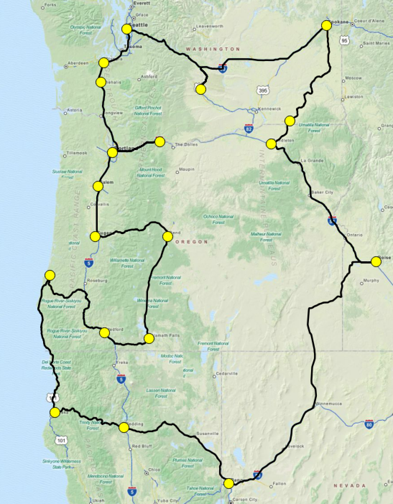

# Optimal Tour

A convenient command-line interface for solving the classic *Traveling Salesman Problem* (TSP)

Given locations as GeoJSON point features, find the shortest tour visiting all points.

    fio cat point_locations.shp | optimal_tour > points_plus_route.geojson

## Dependencies

* Mapbox APIs for directions and distance matrix
* pyconcorde to interface with...
* concorde TSP solver
* click and cligj python libs

## TODO 

This is just a proof of concept. The continued development will be driven by our
collective interest in the project so please contact me via github issues if you have ideas.
